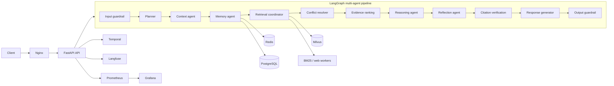

# Burkina Faso Legal AI

A production-grade **agentic AI legal research assistant** for Burkina Faso law
and regulations (national law, OHADA law, case law, official gazette). It
answers legal questions in French (and other languages) with verified,
traceable citations to real legal sources.

Design priorities, in order: **accuracy, reliability, explainability,
traceability, low hallucination**. The system refuses to guess: every
substantive statement must trace to a retrieved evidence chunk, fabricated
citations are rejected automatically, and low-confidence answers are flagged
or escalated for human review.

> **Legal disclaimer.** This system is a legal *research* aid. Its answers are
> grounded in the cited sources but do **not** constitute legal advice. Always
> consult a licensed legal professional for your specific situation.

## Features

| Capability | How it works |
|---|---|
| Multi-agent reasoning pipeline | 13-node LangGraph workflow: guardrail → planner → context → memory → retrieval → conflict resolution → evidence ranking → reasoning → reflection → citation verification → response → output guardrail |
| Grounded answers | Responses are composed strictly from retrieved evidence; every claim carries a numeric citation verified against the evidence list |
| Hybrid retrieval | Vector (Milvus) + keyword (BM25) + government/regulation/case-law/news workers, fused with RRF and authority-weighted ranking |
| Legal conflict resolution | Official source > newer amendment > timeline-in-force; unresolvable conflicts are surfaced, never silently resolved |
| Authority-weighted ranking | Constitution > OHADA treaty > amended law > law > decree > … > blog (see `backend/core/constants.py`) |
| Anti-hallucination controls | Citation verification, reflection self-critique, bounded retries (max 1), grounded-answer policy, refusal path |
| Memory | MemGPT-style tiers: short-term buffer, summaries, long-term semantic memory, user preferences |
| Durable conversations | Temporal workflows survive restarts; memory buffer is persisted |
| Security | JWT + RBAC, input/output guardrails, rate limiting, sandboxed tools, audit logging |
| Observability | Prometheus metrics, Grafana dashboards, Langfuse traces, OpenTelemetry |
| Offline-first | Every dependency (LLM, Milvus, Redis, Temporal) has an in-process fallback; the whole pipeline runs with zero credentials |

## Architecture



## Quickstart

### 1. Local install

```bash
py -m venv .venv
.venv\Scripts\activate          # Windows
# source .venv/bin/activate     # Linux/macOS

pip install -r requirements.txt
pip install -e .
```

### 2. Run offline (no credentials needed)

The default configuration uses the deterministic `mock` LLM provider,
an in-memory vector store, in-process cache and SQLite — nothing external
is required:

```bash
uvicorn backend.api.main:app --host 0.0.0.0 --port 8000
```

### 3. Full stack with Docker (Linux/Ubuntu)

Use the Docker-specific template and set your cloud LLM endpoint:

```bash
cp .env.docker.example .env
# Edit .env:
#   LEGAL_AI_LLM_API_BASE=https://your-ollama-cloud.example.com
#   LEGAL_AI_LLM_MODEL=llama3.1:8b
#   LEGAL_AI_SECRET_KEY=<random-secret>
#   LANGFUSE_NEXTAUTH_SECRET=<random-secret>
#   LANGFUSE_SALT=<random-secret>

# Start the core stack
docker compose up -d --build

# Optional: start Langfuse on port 3002 (avoids conflict with frontend on 3000)
docker compose --profile observability up -d
```

This starts the API, Celery worker, Nginx, PostgreSQL, Redis, Milvus,
Temporal (+ UI on :8080), Prometheus (:9090), Grafana (:3001) and
Langfuse (:3002).

**Embedding with local Ollama:**
The `api` and `celery-worker` containers reach the host's Ollama via
`host.docker.internal:11434` (`extra_hosts: ["host.docker.internal:host-gateway"]`).
Pull the embedding model on the host first and bind Ollama to all interfaces so
Docker can reach it:

```bash
ollama pull nomic-embed-text
OLLAMA_HOST=0.0.0.0:11434 ollama serve
```

### Example request

Chat endpoints require a JWT. In `development` a dev user
`admin` / `admin123` exists (see [docs/api.md](docs/api.md)):

```bash
# 1. get a token
TOKEN=$(curl -s -X POST http://localhost:8000/api/v1/auth/token \
  -H "Content-Type: application/json" \
  -d "{\"username\": \"admin\", \"password\": \"admin123\"}" | py -c "import sys,json; print(json.load(sys.stdin)['access_token'])")

# 2. ask a question
curl -X POST http://localhost:8000/api/v1/chat \
  -H "Authorization: Bearer $TOKEN" \
  -H "Content-Type: application/json" \
  -d "{\"query\": \"Quels sont les droits d'un salarie licencie au Burkina Faso ?\"}"
```

Response (abridged):

```json
{
  "session_id": "…",
  "answer": {
    "answer": "Selon le Code du travail … [1]",
    "citations": [{ "label": "Code du travail, art. 39", "verified": true }],
    "confidence": 0.82,
    "requires_human_review": false,
    "warnings": []
  },
  "trace": ["input_guardrail: allowed", "planner: 3 search tasks", "…"],
  "latency_ms": 1342.5,
  "trace_id": "<langfuse-trace-id>"
}
```

## Frontend

A Next.js 15 (App Router, TypeScript, Tailwind CSS) web UI lives in
[`frontend/`](frontend/). It provides the conversation interface with live
SSE streaming of the agent pipeline, an agent execution timeline, a citation
panel, an evidence viewer with full source metadata, and an optional
JWT login (anonymous calls work in development).

```bash
cd frontend
npm install
npm run dev          # http://localhost:3000
```

The API base URL is configurable via `NEXT_PUBLIC_API_URL` (default behavior
proxies `/backend-api/*` server-side to `http://localhost:8000`, which avoids
CORS issues since the API does not enable CORS; set
`NEXT_PUBLIC_API_URL=http://localhost:8000` in `frontend/.env.local` to call
the API directly when CORS is handled upstream, e.g. via Nginx).

An optional Docker service is also available:

```bash
docker compose --profile frontend up -d --build frontend
```

> Note: the `frontend` service publishes host port **3000**, which Langfuse
> also uses — adjust one of the port mappings if you run both.

## Repository layout

```
.
├── backend/
│   ├── agents/            # LangGraph node implementations (13 nodes)
│   ├── planner/           # planner agent (LLM + heuristic fallback)
│   ├── workflows/         # LangGraph graph construction & runners
│   ├── core/              # models, constants, config, context, ports, llm, cache
│   ├── retrieval/         # hybrid retrieval coordinator & workers
│   ├── vectorstore/       # Milvus adapter + in-memory fallback
│   ├── ingestion/         # document ingestion pipeline
│   ├── memory/            # MemGPT-style memory store
│   ├── guardrails/        # input/output safety checks
│   ├── sandbox/           # sandboxed tool execution
│   ├── tools/             # agent tools
│   ├── api/               # FastAPI application (REST / SSE / WebSocket)
│   ├── security/          # JWT, RBAC, rate limiting
│   ├── observability/     # Prometheus metrics, OTel, Langfuse
│   ├── evaluation/        # metrics, golden dataset, runner
│   └── temporal/          # durable conversation workflows
├── docs/                  # documentation (see below)
├── frontend/              # Next.js web UI (chat, agent timeline, citations, evidence)
├── docker/                # Dockerfile, Nginx, Prometheus, Grafana
├── .github/workflows/     # CI
├── docker-compose.yml     # full stack
├── requirements.txt
└── pyproject.toml
```

## Documentation

- [Architecture](docs/architecture.md) — system design and component responsibilities
- [Agents](docs/agents.md) — the 13 pipeline nodes in detail
- [Workflow](docs/workflow.md) — LangGraph graph, conditional edges, retry budgets
- [Retrieval](docs/retrieval.md) — hybrid RAG pipeline and chunk metadata
- [Memory](docs/memory.md) — MemGPT-style memory tiers
- [Temporal](docs/temporal.md) — durable conversations and resume semantics
- [Database](docs/database.md) — schema (ER diagram)
- [API reference](docs/api.md) — endpoints with examples
- [Deployment](docs/deployment.md) — compose topology and production checklist
- [Operations](docs/operations.md) — runbook and failure modes
- [Monitoring](docs/monitoring.md) — metrics, dashboards, alerts
- [Security](docs/security.md) — auth, guardrails, threat model
- [Testing](docs/testing.md) — running and writing tests
- [Developer guide](docs/developer.md) — extending agents, domains, retrievers
- [Administrator guide](docs/administrator.md) — users, ingestion, evaluations
- [Evaluation](docs/evaluation.md) — quality metrics and the evaluation runner

## Configuration

Everything is configured via environment variables prefixed `LEGAL_AI_`
(see `.env.example` and [deployment docs](docs/deployment.md)). Defaults are
offline-safe: `LEGAL_AI_LLM_PROVIDER=mock`, SQLite database, in-memory cache
and vector store.
