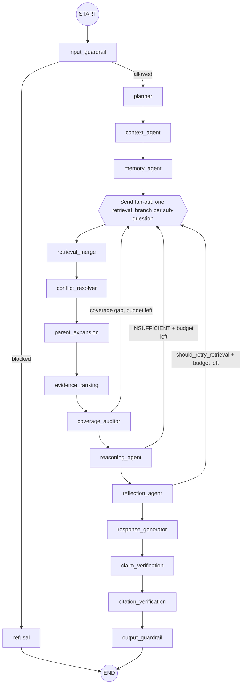

# RAG Architecture (Post-Upgrade)

This document describes the agentic RAG platform **as implemented** after the
"Production-Grade Agentic Legal RAG Platform" upgrade. It supersedes the
pipeline description in [architecture.md](architecture.md) where they differ;
the audit that motivated the changes is in
[RAG_ARCHITECTURE_AUDIT.md](RAG_ARCHITECTURE_AUDIT.md) (pre-upgrade snapshot,
kept for reference). Retrieval internals live in [LEGAL_RETRIEVAL.md](LEGAL_RETRIEVAL.md),
the citation/verification stack in [CITATION_SYSTEM.md](CITATION_SYSTEM.md).

The guiding constraint is unchanged: **an answer may only contain claims that
trace to retrieved evidence**. What changed is how aggressively the pipeline
decomposes, audits and verifies before and after synthesis.

## Pipeline overview

Source of truth: `backend/workflows/graph.py` (`build_graph`).

## Node responsibilities

| Node | Location | Responsibility |
|---|---|---|
| `input_guardrail` | `backend/agents/input_guardrail.py` | Deterministic regex policies (prompt injection, jailbreak, role hijacking, tool abuse block; PII redacted) — see `backend/guardrails/policies.py`. Blocked queries route to `refusal`. |
| `refusal` | `backend/agents/refusal.py` | Terminal node for disallowed queries. |
| `planner` | `backend/planner/agent.py` | Tool-calling LLM agent producing a `RetrievalPlan` (sub-questions, search tasks, legal domains, languages, scenario date). Deterministic classification (`question_type`, `temporal_intent`) and a decomposition fallback guarantee a valid plan with no LLM. |
| `context_agent` | `backend/agents/context_agent.py` | Loads the recent conversation window (`context_max_turns`). |
| `memory_agent` | `backend/agents/memory_agent.py` | Recalls MemGPT-style long-term memory (buffer/summary/semantic/preference). |
| `retrieval_branch` | `backend/agents/retrieval_node.py` | One parallel branch per sub-question: vector + keyword tasks (plus planned auxiliary tasks for that sub-question) through the `RetrievalCoordinator`. |
| `retrieval_merge` | `backend/agents/retrieval_node.py` | Fuses additive `branch_evidence` channels into `evidence`, counts retry passes, resets `needs_more_retrieval`. |
| `conflict_resolver` | `backend/agents/conflict_resolver.py` | Detects same-article disagreements (numeric/word claims) and resolves by version-in-force at the scenario date, then authority, then recency. Unresolved conflicts are surfaced, never silently dropped. |
| `parent_expansion` | `backend/agents/parent_expansion.py` | Replaces retrieved child chunks with their parent (whole article/section) so the LLM sees full context; children stay attached as `parent.child_chunks`, and expanded parents are stamped with the dual `retrieval_text` (matching child passage) / `context_text` (parent content) fields (spec §7). |
| `evidence_ranking` | `backend/agents/evidence_ranking.py` | Deterministic composite score (relevance + authority + confidence, + temporal when the plan has a temporal intent); drops chunks below `min_evidence_score`. |
| `coverage_auditor` | `backend/agents/coverage_auditor.py` | Deterministic (no LLM) check that every planned sub-question is backed by evidence; below `coverage_retry_threshold` it requests one bounded re-retrieval on the missing issues. |
| `reasoning_agent` | `backend/agents/reasoning_agent.py` | LLM analysis over ranked evidence (ESTABLISHED / APPLICABLE RULES / GAPS / CONTRADICTIONS); an `INSUFFICIENT:` prefix triggers one bounded re-retrieval. |
| `reflection_agent` | `backend/agents/reflection_agent.py` | LLM self-critique (`ReflectionResult`); may request one bounded retrieval retry. |
| `response_generator` | `backend/agents/response_generator.py` | LLM-only grounded synthesis with `[n]` markers, evidence screened for injected instructions and wrapped as DATA; builds the `FinalAnswer` (confidence, warnings, breakdown). |
| `claim_verification` | `backend/agents/claim_verification.py` | Post-synthesis, deterministic per-statement support grading (DIRECT/INDIRECT/INSUFFICIENT/CONTRADICTORY); flags warnings and escalates contradictions. |
| `citation_verification` | `backend/agents/citation_verification.py` | Post-synthesis marker check: every `[n]` must resolve to a retrieved chunk; fabricated markers are stripped and confidence is scaled by citation accuracy. |
| `output_guardrail` | `backend/agents/output_guardrail.py` | Final policy gate (`check_output`): refusal policy, unsafe-advice escalation, citation integrity, unverified-article warnings, confidence policy, context-sensitive disclaimer. |

## Orchestration semantics

### Fan-out with `Send`

`_fanout_retrieval` emits one `Send("retrieval_branch", ...)` per non-empty
`plan.sub_questions` entry (falling back to the raw query when the plan has no
decomposition). Branches run concurrently; because plain state channels cannot
be written by concurrent nodes, branch results travel on the additive
`branch_evidence` / `branch_trace` channels and `retrieval_merge` reduces them
into `evidence`.

### Bounded retry loops

Three conditional edges route back into the fan-out, all bounded by settings
(defaults: `max_retrieval_retries=1`, `max_reflection_iterations=1`):

- `coverage_auditor` → fan-out on the auditor's `missing_issues` (not the whole
  plan) when `coverage < coverage_retry_threshold` and the retry budget allows.
- `reasoning_agent` → fan-out when the LLM answered `INSUFFICIENT:`.
- `reflection_agent` → fan-out when `reflection.should_retry_retrieval`.

`retrieval_merge` increments `retrieval_retries` once per pass and resets
`needs_more_retrieval`, so loops terminate by construction.

### Post-synthesis review order

`claim_verification` and `citation_verification` run **after**
`response_generator`, so both judges see the actual drafted answer. Claim
verification runs first because claims are built on the draft *with* its `[n]`
markers (they designate the intended sources); if citation verification later
strips an unverifiable marker, the claim keeps its recorded support level. Both
nodes sync their verdicts back into the `FinalAnswer` (warnings, confidence,
`requires_human_review`).

### Per-request LLM override

Every node is wrapped by `bind()`, which swaps `ctx.llm` for a per-request
client when the API layer set `state["llm"]` (tier-gated model router). No node
reads provider configuration directly.

### Task-based model tiering (spec §46)

The strongest model is **not** called at every node. `bind(fn, role=...)`
additionally routes a node's LLM calls through `resolve_role_llm`
(`backend/core/model_roles.py`) when `model_role_routing_enabled` is on
(default **off** — zero behavior change): a role with a configured override
(`planner_model`, `classification_model`, `analysis_model`, `synthesis_model`)
gets a client bound to that model on the *same* provider as the request's
resolved model; every other node keeps the request's client untouched. Role
mapping in `build_graph`: `classification` → `context_agent` / `memory_agent`
(cheap), `planner` → `planner` (cheap), `analysis` → `reasoning_agent` /
`reflection_agent`, `synthesis` → `response_generator` (strongest, final
answer). A `FailoverLLMClient` base keeps its fallback chain with the
role-model client as the new primary. Role clients **share the base client's
`usage_totals` accumulator**, so the API layer's per-request delta metering
covers every role's tokens with no aggregation change. With the `mock`
provider model names are inert, so role routing is a strict no-op offline.

## Provider abstractions

Agents depend on ports, never on SDKs (`backend/core/ports.py`); `AppContext`
(`backend/core/context.py`) wires the concrete adapters once per process.

- **LLM** — `backend/core/llm.py`: `LLMClient` over LiteLLM (OpenAI, Anthropic,
  Gemini, DeepSeek, Qwen, Kimi, Ollama/Ollama Cloud, OpenRouter, TokenFree,
  `mock`). JSON mode with one corrective retry (`complete_json`), tool calling
  with native/manual fallback (`complete_tools`), cumulative token metering.
  `FailoverLLMClient` chains credentialed providers (`llm_fallback_providers`)
  so one broken provider never degrades the answer path.
- **Embeddings** — `backend/core/embeddings.py`: `LiteLLMEmbeddings`
  (OpenAI-compatible, batched at 200) when credentials exist, otherwise
  deterministic `HashEmbeddings` (bag-of-hashed-tokens) so vector search,
  memory and tests run fully offline.
- **Vector store** — `backend/vectorstore/`: `MilvusVectorStore` (HNSW/COSINE,
  native scalar filters on `document_id`/`article`/`status`/`document_type`,
  schema self-heal on connect) with `InMemoryVectorStore` fallback via
  `factory.py` when Milvus is disabled or unreachable.
- **Cache / memory / retrieval** — `InMemoryCache` or Redis; `MemoryStore`;
  `RetrievalCoordinator` behind `RetrieverProtocol`.
- **Reranker** — `backend/retrieval/reranker_providers.py` behind the
  `RerankerProvider` port: offline `HeuristicReranker` (the default, zero
  credentials) or `ApiCrossEncoderReranker` (Cohere-style `/rerank` endpoint,
  batched, one retry, falls back to heuristic on any failure). Selected by
  `reranker_provider`; `api` without full credentials degrades to heuristic.
- **Legal knowledge graph** — `backend/knowledge/` (`LegalGraphStore`,
  spec §19/§34): a relational store (SQLAlchemy Core, `database_url` with a
  SQLite fallback under `data_dir`) holding `documents`, `legal_articles` and
  `legal_relationships` tables, populated at ingestion and used by the graph
  retrieval worker for explicit article/law lookup and neighbour expansion.
  Best-effort everywhere — it can never break ingestion or retrieval. See
  [LEGAL_RETRIEVAL.md](LEGAL_RETRIEVAL.md#legal-knowledge-graph-spec-19).

## Deterministic legal tools (spec §32)

`backend/tools/legal_calculations.py` is a pure calculation engine — no LLM is
ever asked to do arithmetic deterministic code can do:

- `compute_notice_period` (préavis by worker category),
  `compute_severance` (indemnité de licenciement via marginal seniority
  brackets, partial years prorated),
- `compute_deadline` (calendar deadlines: days/weeks/months, French date
  parsing) and `compute_simple_interest` (actual/365) — pure arithmetic, marked
  `verified=True`, with explanations stating the legal basis must come from the
  applicable text.

Each result is a `CalculationResult` carrying the value, the provision
citation, a French explanation and a `verified` flag. **Honesty contract**: the
rules in `backend/tools/legal_rules.json` encode the commonly documented
structure of the Code du travail (loi n°028-2008/AN) but are flagged
`verified: false` — every duration/rate must be checked against the current
official text before production use, and the flag propagates to every result so
values are never silently treated as authoritative. Uncovered
categories/brackets raise `RuleNotFound` — the engine never guesses. The module
is library code; wiring it into the planner/tool loop for
`QuestionType.CALCULATION` plans is a deliberate follow-up.

## Offline-first fallbacks

Every external dependency degrades to a working in-process substitute; node
functions record incidents in `state["errors"]` instead of raising:

| Dependency | Fallback |
|---|---|
| LLM provider | `mock` provider (deterministic, restates only provided evidence) + heuristic planner |
| Embeddings | `HashEmbeddings` |
| Milvus | `InMemoryVectorStore` (`LEGAL_AI_MILVUS_ENABLED=false` or unreachable) |
| Redis | `InMemoryCache` |
| PostgreSQL | SQLite (`sqlite+aiosqlite`, the default `LEGAL_AI_DATABASE_URL`) |
| Temporal | synchronous execution (`LEGAL_AI_TEMPORAL_ENABLED=false`) |
| Rerank endpoint | `HeuristicReranker` (default `LEGAL_AI_RERANKER_PROVIDER=heuristic`; `api` without credentials also degrades to it) |
| Graph store database | SQLite fallback `data/legal_graph_fallback.db`; when unreachable the graph degrades to no-op writes / empty reads |

The whole pipeline — planner, retrieval, reasoning, synthesis, verification —
runs end-to-end with zero API keys, which is what the offline evaluation runner
and the test suite rely on.

## Request lifecycle

REST, SSE and WebSocket entry points all funnel through
`backend/workflows/graph.py` helpers: `initial_state` builds the `GraphState`
(query, session, retry counters, trace), `run_query` invokes the compiled graph
and returns a `ChatResponse` (persisting the turn to memory best-effort), and
`stream_query` yields per-node update events for streaming clients.
