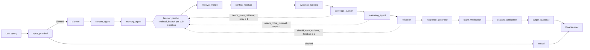
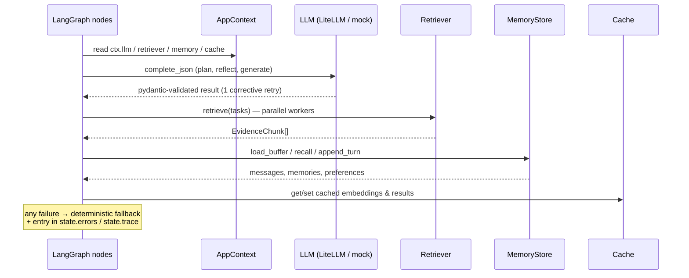

# Agents

The pipeline is a LangGraph `StateGraph` (see
[workflow.md](workflow.md) for the full graph). Every node has the signature
`async def node(state: GraphState, ctx: AppContext) -> dict` and returns
only the state keys it updates. Nodes never raise on LLM/infrastructure
failure — they degrade to deterministic behavior and append to
`errors`/`trace`.

## input_guardrail (`backend/agents/input_guardrail.py`)

First line of defense. Delegates to
`backend.guardrails.input_guard.check_input` to detect prompt injection,
jailbreaks, sensitive-info leaks, role hijacking and tool abuse. Produces a
`GuardrailResult` (`allowed`, `flags`, `reasons`, optional
`sanitized_query`). A blocked query routes to `refusal`; a sanitized query
replaces the original in state.

## planner (`backend/planner/agent.py`)

Converts the raw question into a `RetrievalPlan`: sub-questions, typed
`SearchTask`s (`vector`, `keyword`, `government`, `regulation`, `case_law`,
`news`, …), matched legal domains, retrieval language (French) and response
language. With a real LLM provider it calls `complete_json` (which itself
allows one corrective retry); on any failure — and with the `mock` provider
— it uses `heuristic_plan`, a keyword-driven deterministic planner that can
never hallucinate. Also extracts an optional `scenario_date` for legal
timeline reasoning.

## context_agent (`backend/agents/context_agent.py`)

Loads the conversation window from the memory store
(`load_buffer(session_id, limit=20)`, i.e. the last 10 turns) so answers
stay coherent across long conversations, server restarts and workflow
interruptions.

## memory_agent (`backend/agents/memory_agent.py`)

MemGPT-style recall: pulls up to 5 relevant long-term semantic memories and
summaries (`ctx.memory.recall(user_id, query)`) plus the user's preferences
(`get_preferences`). These shape retrieval and the tone/language of the
answer.

## retrieval_branch / retrieval_merge (`backend/agents/retrieval_node.py`)

Retrieval is fanned out with LangGraph `Send`: **one `retrieval_branch` node
per decomposed sub-question**, all running in parallel. Each branch runs its
own vector + keyword search (plus any planned auxiliary task for its
sub-question) through `ctx.retriever` (`RetrievalCoordinator`) and writes to
the additive `branch_evidence` / `branch_trace` channels (plain state channels
cannot be written concurrently). `retrieval_merge` then fuses all branches,
deduplicates by `chunk_id`, merges with evidence already in state (retry
passes accumulate), and increments `retrieval_retries` on bounded retry
passes.

## conflict_resolver (`backend/agents/conflict_resolver.py`)

Detects chunks that disagree about the same article of the same code.
Resolution order (from the spec): (1) prefer the official government source
by authority weight, (2) prefer the latest law/amendment by publication and
effective dates, (3) for a scenario date, prefer the version in force at
that date. Each decision is recorded as a `ConflictReport` with a human-
readable `reason`; conflicts that cannot be resolved (`resolved=false`) are
surfaced in the answer instead of being guessed away.

## evidence_ranking (`backend/agents/evidence_ranking.py`)

Scores every chunk with one formula
(`0.55 × relevance + 0.30 × authority + 0.15 × confidence`, where relevance
is `max(rerank_score, retrieval_score)` and authority comes from
`AUTHORITY_WEIGHTS`). Chunks below `MIN_EVIDENCE_SCORE` (0.05) are dropped.
Output: `ranked_evidence`.

## reasoning_agent (`backend/agents/reasoning_agent.py`)

Reads only the ranked evidence, identifies what is established, what is
missing and any contradictions. May set `needs_more_retrieval` to trigger
**one** bounded retrieval retry. With no usable evidence it states that
explicitly instead of guessing (grounded answer policy).

## reflection (`backend/agents/reflection_agent.py`)

Self-critique before answering: did the analysis answer every part of the
question, is every claim citable, could anything be hallucinated, are there
contradictions? Produces a `ReflectionResult`. May request one retrieval
re-run (`should_retry_retrieval`), bounded by `MAX_REFLECTION_ITERATIONS=1`
and the shared retrieval retry budget. Falls back to a heuristic reflection
without an LLM.

## claim_verification (`backend/agents/claim_verification.py`)

Post-synthesis, pre-citation-stripping pass (spec §20/§21/§44): runs between
`response_generator` and `citation_verification`. Splits the draft into
substantive statements (headings, source lists and short connectors skipped),
grades each against the evidence with deterministic heuristics
(`direct`/`indirect`/`insufficient`/`contradictory`, reusing the coverage
auditor's discriminative terms plus a conservative number-mismatch check) and
attaches the resulting `Claim` list to the `FinalAnswer`. Insufficient claims
raise bilingual warnings; contradictory ones also set
`requires_human_review`. Recomputes
`confidence_breakdown.legal_support_confidence` as the supported-claim
fraction dampened by the contradicted share; the aggregate `confidence` is
untouched.

With a real LLM provider (`claim_llm_refinement_enabled`, skipped for the
`mock` provider), heuristic-supported claims are then re-graded by an LLM
entailment check (`CLAIM_VERIFIER_SYSTEM`, verdicts
`explicit`/`inferred`/`unsupported`/`contradicted`) that catches what term
overlap cannot: provisions applied to a legal mechanism they do not govern
(e.g. the matrimonial-regime "passer seul un acte" article cited for a
divorce conclusion) and inexact numbers/durations. The refinement only ever
downgrades support and fails open to the heuristic grades. Claims flagged as
deductions (`inferred`) or unverifiable are recorded in
`FinalAnswer.metadata` (`inferred_claims` / `unverified_claims`) and surfaced
to the user by the output guardrail's caution note.

## citation_verification (`backend/agents/citation_verification.py`)

Post-synthesis judge: runs AFTER `response_generator`. Parses `[n]` citations
from the draft and resolves each against the actual evidence list. Verified
citations are kept; fabricated or unresolvable ones are removed from the
answer and recorded as warnings — never silently kept. Its verdict is synced
into the `FinalAnswer` (text cleanup, confidence scaled by citation accuracy).

## response_generator (`backend/agents/response_generator.py`)

Composes the final answer strictly from the numbered evidence excerpts,
citing every substantive statement. Without an LLM it uses a deterministic
template that quotes only real evidence — it cannot invent legal content.
Retrieval language is French; the LLM translates when the user asked in
another language (the template states the language limitation).

## output_guardrail (`backend/agents/output_guardrail.py`)

Final policy gate. Applies confidence thresholds (warning below 0.55,
`requires_human_review` below 0.40), unsafe-legal-advice detection, and
appends the mandatory legal disclaimer (French/English). When claim
verification flagged deductions or unverifiable statements
(`FinalAnswer.metadata["inferred_claims"]` / `["unverified_claims"]`), a
bilingual caution note is appended to the answer body before the disclaimer —
this note is user-facing and survives the production wiping of internal
warnings.

## refusal (`backend/agents/refusal.py`)

Terminal node for blocked queries. Returns a `FinalAnswer` with
`refused=true`, the guardrail flags and a bilingual explanation.

## Interaction with shared services

