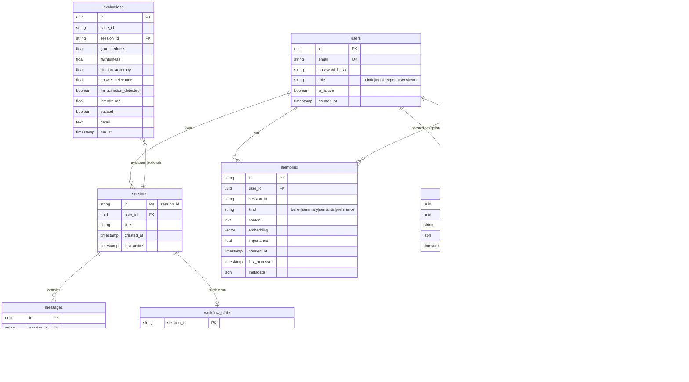

# Database Schema

PostgreSQL in production (`LEGAL_AI_DATABASE_URL`), SQLite via `aiosqlite`
for development and tests.

**Implementation status.** The SQLAlchemy tables currently defined in code
are `messages`, `memories` and `preferences`, built in
`backend/memory/store.py` (`MemoryStore._build_schema`, created on first
use; if the database is unreachable the store falls back to a local SQLite
file and, failing that, to in-memory only). The remaining tables below are
the **designed schema** for the API/security/evaluation/Temporal layers
(users are currently an in-memory dev store in
`backend/api/routers/auth.py`); they are documented here as the target
model those layers persist to.

## Notes

- `memories.kind` mirrors the MemGPT tiers described in
  [memory.md](memory.md); `embedding` lives in Milvus for semantic recall,
  with the row in Postgres as the system of record.
- `documents` / `document_versions` back the ingestion pipeline and legal
  timeline reasoning: `effective_date` per version lets the conflict
  resolver pick the version in force at a scenario date. Re-ingesting a
  changed document bumps `current_version` and records a new
  `document_versions` row (deduped by `content_hash` →
  `skipped_duplicate`).
- `evaluations` stores one row per golden-dataset case run
  (`EvalCaseResult` in `backend/core/models.py`).
- `audit_logs` records security-relevant events (logins, blocked queries,
  ingestion, role changes) — see [security.md](security.md).
- `workflow_state` lets the API reconnect a `session_id` to its Temporal
  workflow after a restart (see [temporal.md](temporal.md)).
