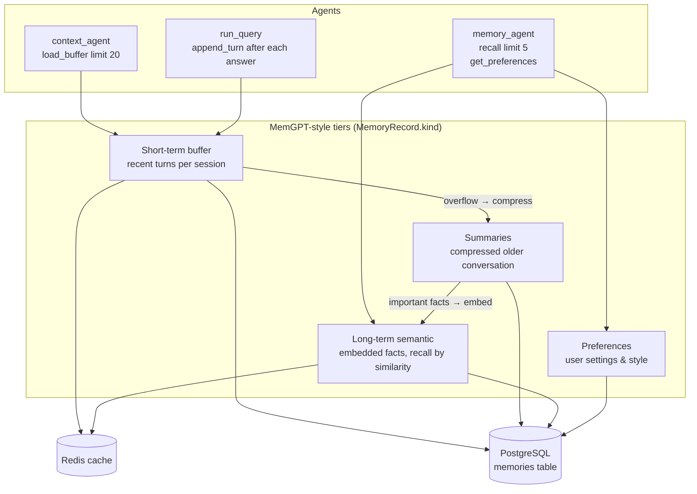

# Memory

Memory follows a MemGPT-style tiered design, implemented behind
`MemoryStoreProtocol` (`backend/core/ports.py`) by
`backend/memory/store.py` (`MemoryStore`, with `summarizer.py` and
`pruning.py`). Redis is the hot cache, PostgreSQL the durable store (SQLite
in development — and if the configured database is unreachable the store
falls back to a local `memory_fallback.db` file, then to in-memory only).
The SQLAlchemy tables (`messages`, `memories`, `preferences`) are defined
in `store.py` and created on first use.

## Tiers

- **Short-term buffer** — the last turns of a session. The context agent
  loads the last 20 messages (10 turns, `MAX_CONTEXT_TURNS = 10`) into the
  prompt window. Persisted, so the context survives restarts.
- **Summaries** — when the buffer overflows, older turns are compressed into
  summary records instead of being dropped.
- **Long-term semantic memory** — salient facts stored with embeddings and
  an `importance` score (0–1, default 0.5); the memory agent recalls the top
  5 by similarity to the current query.
- **Preferences** — per-user settings (language, answer style, expertise
  level) applied by the response generator.

## Record shape

`MemoryRecord` (`backend/core/models.py`): `id`, `user_id`, `session_id`,
`kind` (`buffer | summary | semantic | preference`), `content`, optional
`embedding`, `importance`, `created_at`, `last_accessed`, `metadata`.

## Pruning and compression

- Records are scored by `importance`, recency (`last_accessed`) and usage;
  low-value records are pruned first when quotas are hit.
- Buffer overflow triggers summarization (LLM when configured, deterministic
  truncation otherwise).
- Redis entries are TTL-bound (`LEGAL_AI_CACHE_TTL_SECONDS`); a Redis outage
  degrades to the process-local `InMemoryCache` with no functional loss.

## Reliability

Memory writes are **never on the critical path**: `run_query` wraps
`append_turn` in a best-effort `try/except` so a memory failure can never
break an answer.
