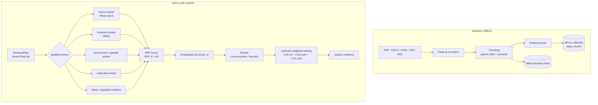

# Retrieval (Hybrid RAG)

Retrieval is driven by the planner's `RetrievalPlan`: a list of typed
`SearchTask`s (`vector`, `keyword`, `web`, `website`, `government`,
`case_law`, `news`, `regulation`, `uploaded`). The `retrieval_coordinator`
node hands all tasks to `RetrievalCoordinator`
(`backend/retrieval/coordinator.py`), which runs the workers concurrently
and fuses their results.

Each worker fetches up to `RETRIEVAL_FETCH_K = 20` candidates before fusion;
the planner defaults to `DEFAULT_TOP_K = 8` results per task.

## Chunk metadata

Every chunk (`EvidenceChunk`, `backend/core/models.py`) carries:

| Field | Purpose |
|---|---|
| `chunk_id`, `parent_chunk_id` | Identity and parent-child linkage (small chunks for matching, parents for context) |
| `document_id`, `document_name`, `version` | Source document and its version |
| `article`, `section`, `page` | Precise legal locator for citations |
| `publication_date`, `effective_date` | Legal timeline reasoning (which version was in force when) |
| `government_body`, `url` | Issuing authority and canonical link |
| `source_kind` | Which worker produced it (`SearchKind`) |
| `authority` | `AuthorityLevel` — drives `AUTHORITY_WEIGHTS` ranking (constitution 1.00 … blog 0.10) |
| `language` | Mostly `fr` |
| `confidence`, `retrieval_score`, `rerank_score` | Source confidence, raw retriever score, post-rerank score |
| `metadata` | Free-form extras |

This metadata is what makes every citation traceable end to end — the
citation verification agent resolves `[n]` labels back to these chunks.

## Authority weighting

After fusion and reranking, the evidence-ranking agent combines scores as
`0.55 × relevance + 0.30 × AUTHORITY_WEIGHTS[authority] + 0.15 × confidence`
and drops anything below `MIN_EVIDENCE_SCORE = 0.05`. Official Burkina Faso
and OHADA domains (`OFFICIAL_DOMAINS` in `constants.py`) are never outranked
by blogs or news.

## Caching points

The `CacheProtocol` (Redis with in-process fallback, TTL
`LEGAL_AI_CACHE_TTL_SECONDS`, default 3600 s) is used for:

- **embeddings** — repeated texts are not re-embedded,
- **search/retrieval results** — identical tasks short-circuit,
- **LLM responses / prompts** — planner and reflection calls,
- **frequent legal questions** — full retrieval results for hot queries.

All cache failures degrade silently to a cache miss.
