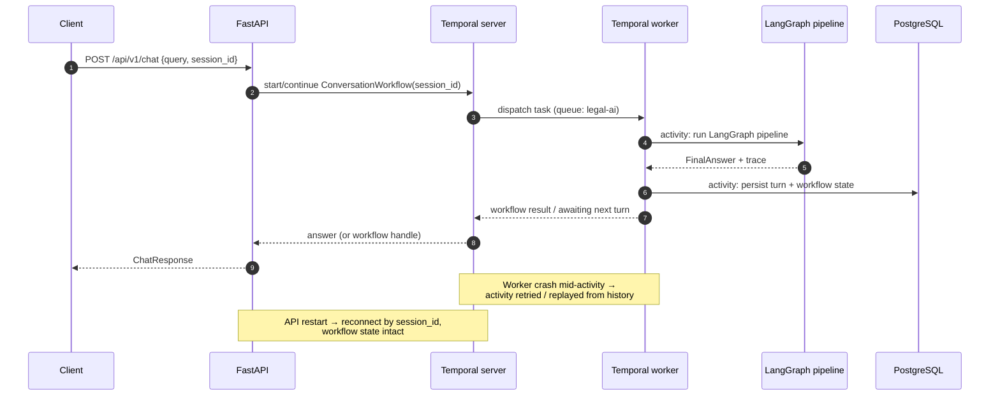

# Temporal — Durable Conversations

Temporal makes long-running chat sessions durable: an in-flight conversation
survives API restarts, worker crashes and redeployments, and resumes exactly
where it stopped. It is **optional** — `LEGAL_AI_TEMPORAL_ENABLED=false`
(default) runs everything synchronously in-process, which is how dev and
tests operate.

> **Implementation:** `backend/temporal/` — `workflows.py`
> (`ConversationWorkflow`, `IngestionWorkflow`), `activities.py`
> (`run_chat_turn_activity`, `ingest_path_activity`), `worker.py`
> (`python -m backend.temporal.worker`) and `client.py`. The decorators
> degrade to no-ops when `temporalio` is not installed, keeping the module
> importable everywhere.

## Concepts

- **Workflow** — one per conversation (`session_id`). Holds conversation
  state (turn count, last summary, pending user input) and exposes
  update/signal handlers for new messages.
- **Activities** — the units of work with retry semantics: running the
  LangGraph pipeline, memory summarization, persistence. Activities are
  idempotent by design (state keys, deduped `chunk_id`s).
- **Task queue** — `LEGAL_AI_TEMPORAL_TASK_QUEUE` (default `legal-ai`); any
  number of workers can poll it, which is how chat throughput scales
  independently of the API tier.
- **Worker** — runs alongside (or instead of) the Celery worker using the
  same `legal-ai-burkina` image; connects to
  `LEGAL_AI_TEMPORAL_ADDRESS` (default `localhost:7233`, `temporal:7233` in
  compose).

## Resume-after-interruption semantics

- If the **worker** dies mid-run, Temporal re-dispatches the activity to
  another worker with its retry policy; completed activities are not
  re-executed (their results are in the event history).
- If the **API** dies, the workflow keeps running server-side; the client
  reconnects with the same `session_id` and retrieves the result.
- The LangGraph retry budgets (max 1) are independent of Temporal activity
  retries: Temporal retries the *activity invocation*, not the agentic
  reasoning loop.
- The persisted memory buffer plus `workflow_state` table (see
  [database.md](database.md)) guarantee that even a full stack restart loses
  no conversation context.

## Local UI

`docker compose up` starts the Temporal Web UI on
[http://localhost:8080](http://localhost:8080) — inspect workflow histories,
pending activities and stuck conversations there.
