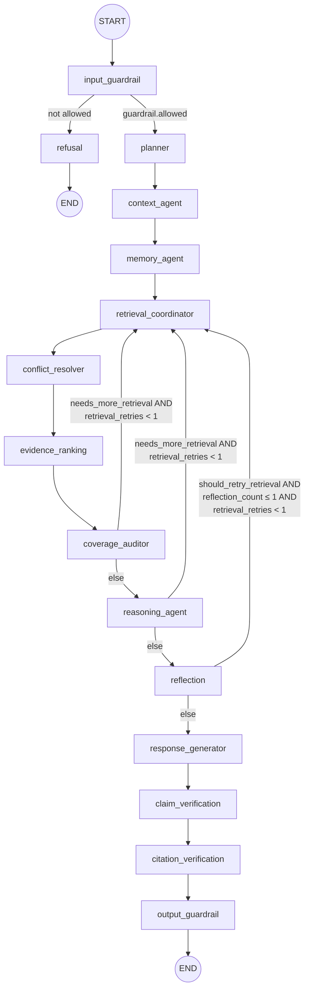
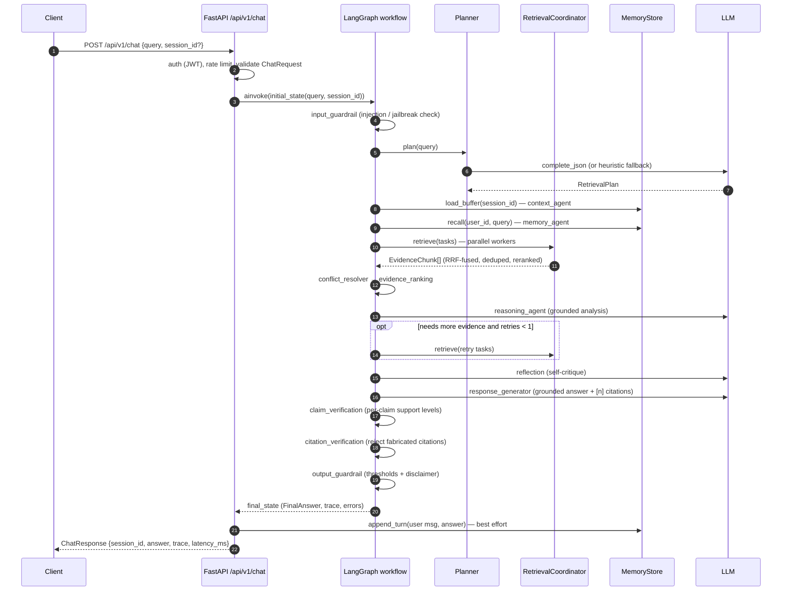

# Workflow

The exact pipeline is defined in `backend/workflows/graph.py`
(`build_graph`). Retry budgets come from `backend/core/config.py`:

| Budget | Value | Enforced in |
|---|---|---|
| `max_retrieval_retries` | 1 | `_route_after_reasoning`, `_route_after_reflection` |
| `max_reflection_iterations` | 1 | `_route_after_reflection` |

The planner's corrective JSON retry is a fixed single retry inside
`LLMClient.complete_json` (not configurable).

## Graph

Notes on the routing functions (verbatim from `graph.py`):

- `_route_after_guardrail` — blocked queries go straight to `refusal`.
- `_route_after_reasoning` — the reasoning agent may request one extra
  retrieval pass (`needs_more_retrieval`) as long as the shared retrieval
  retry budget is not exhausted.
- `_route_after_reflection` — reflection may send the state back to
  `retrieval_coordinator` at most once; both the reflection budget and the
  retrieval budget are checked.

The state (`GraphState`, `backend/core/state.py`) is a `TypedDict` with
`total=False`; each node returns only the keys it updates. Retry counters
(`planning_retries`, `retrieval_retries`, `reflection_count`) are explicit
state keys, which makes the "max retry = 1" policy inspectable at runtime.

## Full chat request — sequence

## Streaming

`stream_query` uses `graph.astream(state, stream_mode="updates")` and yields
`{"node": <name>, "update": <serialized state patch>}` events — this powers
both the SSE endpoint and the WebSocket endpoint, so clients can render
progress node by node.
